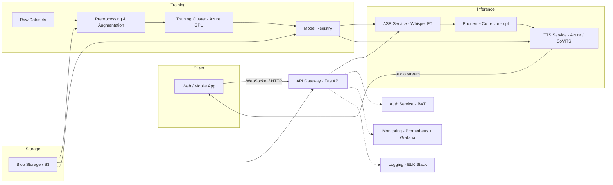

# Speech-Impairment → Clear Speech Converter

**Contents**

1. Executive summary
2. Tech plan: frontend, backend, models, data pipeline
3. Architecture diagram (Mermaid)
4. Detailed components
   - Data collection & preprocessing
   - Model training (ASR fine-tune, phoneme-corrector, TTS/voice clone)
   - Inference pipeline (streaming + batch)
   - APIs
   - Mobile/web client details
5. Dev roadmap (4-week MVP + extensions)
6. Infrastructure, cost & resources
7. Security, privacy & ethics
8. Evaluation metrics & testing
9. Appendix: training commands & sample config

---

## 1) Executive summary

Build an MVP that converts impaired/slurred speech into clear, natural-sounding audio in near real-time. Use a two-stage pipeline: (A) impaired audio → normalized text (fine-tuned Whisper or phoneme-correction model) and (B) normalized text → clear speech (Azure Custom Neural Voice or open-source voice conversion). Focus on a convincing demo (5–10 samples) and real-time-ish latency (<500 ms inference target).

---

## 2) High-level tech plan

### Frontend
- Platforms: Web (React) + Mobile (React Native or Flutter). Start with a web demo.
- Features:
  - Microphone recording & streaming (WebRTC / WebAudio + WebSocket)
  - Real-time transcript display
  - Play corrected audio
  - Voice profile setup (record 10–30s sample)
  - Settings: offline mode, privacy toggle
  - Accessibility: large buttons, keyboard navigation, captions

### Backend
- API Gateway (FastAPI) + WebSocket endpoints for streaming
- Inference services (containerized) for:
  - ASR (fine-tuned Whisper or Whisper-ONNX)
  - Phoneme-corrector (optional)
  - TTS/voice-clone service
- Orchestrator: lightweight Redis-based queue (RQ) or Celery for non-streaming tasks
- Authentication: OAuth2 + JWT for registered users

### Models
- ASR: Whisper (small/medium) fine-tuned on dysarthric datasets
- Optional phoneme-path: Forced aligner (MFA) → phoneme-corrector transformer → G2P
- TTS: Azure Custom Neural Voice or open-source (SoVITS/RVC or VITS)
- Model serving: ONNX Runtime for edge; Triton or TorchServe for server-side

### Data pipeline
- Ingest: WAV/MP3 uploads; live streams
- Preprocess: resample to 16 kHz mono; trim silence; normalize amplitude
- Augmentation: time-stretch, pitch-shift, phoneme substitution, noise
- Storage: S3 or Azure Blob for labeled datasets (private buckets)

---

## 3) Architecture diagram (Mermaid)



---

## 4) Detailed components

### A. Data collection & preprocessing

**Sources**
- Open datasets: TORGO, UASpeech, ALS datasets
- Simulated impairment pipeline (for bootstrapping)
- Optionally recruit volunteers (consent + IRB-style protocol)

**Preprocessing steps**
1. Convert to 16 kHz, mono, 16-bit PCM WAV
2. Trim leading/trailing silence (librosa or sox)
3. Voice activity detection (webrtcvad)
4. Normalize amplitude (rms-loudness)
5. Optionally split long recordings into utterances (VAD)

**Augmentations**
- Time-stretch (0.9–1.2)
- Pitch-shift (±2 semitones)
- Add background noise (SNR 10–30 dB)
- Phoneme-level distortions (insert/delete/replace)


### B. ASR model training (fine-tune Whisper)

**Why Whisper:** robust pretraining, supports finetuning and produces strong transcripts. Start with `whisper-small` or `whisper-medium`.

**Training steps (summary):**
1. Prepare dataset CSV: `audio_path, transcript`
2. Tokenize using Whisper tokenizer (lowercase, punctuation normalization)
3. Use HuggingFace Trainer or custom training loop with gradient accumulation
4. Hyperparameters: LR=1e-5, batch=8–16, epochs=5–12 (monitor val WER)
5. Mixed precision (fp16) for speed
6. Save best model to model registry (MLflow or simple storage)

**Alternatives:** wav2vec 2.0 (fine-tune with CTC) + phoneme-level mapping


### C. Phoneme-corrector (optional advanced path)

**Goal:** fix systematic phoneme errors rather than raw text only.

**Pipeline:**
- Forced aligner (MFA) to extract phoneme sequences
- Train seq2seq transformer (phoneme_input → phoneme_target)
- Advantages: more robust to slurred consonants/vowels


### D. TTS / Voice cloning

**Options:**
- **Azure Custom Neural Voice**: easiest, high-quality. Requires ethical approvals and consent for voice cloning.
- **Open-source**: RVC, SoVITS, VITS — require more setup but fully local.

**Production details:**
- For MVP, use Azure TTS to reduce engineering overhead
- For offline demo, train a local SoVITS voice with 1–5 minutes audio


### E. Inference pipeline

**Modes:**
- **Streaming (low-latency):** chunked audio sent via WebSocket to ASR service → partial transcripts → corrected text → TTS streaming
- **Batch (higher quality):** full utterance processed and returned as audio

**Latency targets:**
- ASR chunk inference: 100–300 ms per chunk
- TTS synthesis latency: 100–300 ms (depends on model)
- Overall end-to-end target: <= 500 ms for short utterances

**Server-side considerations:**
- Use GPU instances for ASR/TTS if real-time
- Use ONNX to accelerate on CPU where possible
- Use Triton for model ensemble serving if multiple models


### F. APIs

**REST endpoints (examples):**
- `POST /v1/recordings` — upload audio for batch processing
- `WS /v1/stream` — streaming microphone audio
- `POST /v1/voice-profile` — upload sample for voice clone
- `GET /v1/transcript/{id}` — fetch corrected transcript
- `GET /v1/audio/{id}` — fetch generated audio

**Auth:** token-based with scopes for `upload`, `synthesize`, `admin`


### G. Client implementation notes

**Web (React)**
- Use `MediaRecorder` / `getUserMedia` for capture
- Use `AudioWorklet` for low-latency chunking
- Use WebSocket to send small frames (20–200 ms) depending on model

**Mobile (React Native / Flutter)**
- Use native microphone APIs (AudioRecord / AVAudioEngine)
- Use gRPC or WebSocket for streaming

---

## 5) Development roadmap (MVP 4 weeks)

**Week 0 (planning & infra)**
- Finalize scope (English only? regional? demo scenarios)
- Provision Azure credits / test GPU
- Set up repo, CI, and basic infra

**Week 1 (ASR baseline)**
- Download datasets & preprocess
- Fine-tune Whisper-small on impaired speech
- Build simple HTTP API for batch audio → transcript

**Week 2 (TTS & voice)**
- Integrate Azure TTS or train open-source voice
- Build pipeline: audio upload → transcript → TTS audio
- Create web demo to upload and play results

**Week 3 (Streaming & polish)**
- Implement WebSocket streaming for partial transcripts
- Low-latency TTS or small buffer streaming
- UI polish and accessibility

**Week 4 (Testing & submission)**
- Collect 10–20 real samples (with consent) and test
- Measure WER, MOS, latency
- Record demo video (2 min) + write documentation


## 6) Infrastructure, cost & resources

**Minimum for MVP:**
- 1 dev (or 2) with some ML experience
- 1 Azure GPU VM for fine-tuning (Standard_NC or ND series) — can use spot instances
- Azure Blob Storage or S3
- FastAPI server on small VM (e.g., B2ms) for/frontend

**Estimated costs (approx):**
- Azure GPU training: $0.5–3/hr depending on SKU; ~50–200 hours for fine-tuning depending on model size
- Storage: negligible for MVP
- TTS (Azure) costs: small per minute synthesized (consult Azure pricing)


## 7) Security, privacy & ethics

- Encrypt audio at rest (server-side) with AES-256
- Use TLS for all network transfer
- Consent forms for any voice cloning
- Option for local-only processing (ONNX on-device) for privacy
- Transparent data retention policy (delete after X days by default)
- No persistent logging of user audio without explicit opt-in


## 8) Evaluation metrics & testing

**ASR metrics:**
- WER (Word Error Rate)
- CER (Character Error Rate)

**Perceptual metrics:**
- MOS (Mean Opinion Score) collected from 10–30 raters
- Intelligibility tests (percent correct transcription by naive listeners)

**Latency & throughput:**
- 95th percentile end-to-end latency
- Max concurrent streams per GPU


## 9) Appendix: sample training commands & config

**Data prep (example)**
```bash
# install ffmpeg, sox
ffmpeg -i input.mp3 -ac 1 -ar 16000 output.wav
python split_utterances.py --input_dir data/raw --output_dir data/processed
```

**Whisper fine-tune (huggingface skeleton)**
```python
from transformers import WhisperForConditionalGeneration, Seq2SeqTrainer, TrainingArguments
# pseudocode: load dataset, preprocess, model, tokenizer, then train
```

**ONNX export (inference)**
```python
# after training
model.to_onnx('whisper_ft.onnx', ...)
# then run with onnxruntime
```


---


